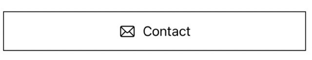
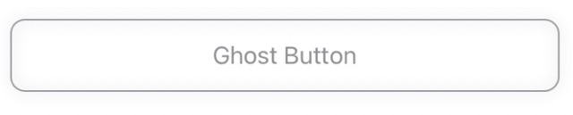
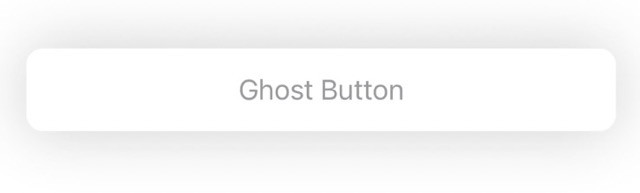

#  Custom SwiftUI Buttons
Based on the challenge in codewithchris.com's design course module one, lesson 6. This repo shows you
how to implement two types of custom buttons that change their appearance based on pressed/ not in 
SwiftUI.

Original challenge found here: https://learn.codewithchris.com/courses/take/design/texts/25883402-lesson-6-challenge

# Custom Fade Black Button
## Design
### Not Pressed
When not pressed, the button appears like this:


### Pressed
Once the user presses the button, the background changes to black, and the text changes to white:


## Custom Style Code
```
import SwiftUI

struct CustomFadeBlackButton: ButtonStyle {
 
    /// Configuration refers to the button itself
    func makeBody(configuration: Configuration) -> some View {
        ZStack {
        
            // If configuration is pressed make rectangle black
            if configuration.isPressed {
                Rectangle()
                    .foregroundColor(.black)
                    .frame(height: 50)
                    .padding()
            }
            else {
                Rectangle()
                    .strokeBorder(.black)
                    .frame(height: 50)
                    .padding()
            }
           
            
            HStack {
                Image(systemName: "envelope")
                // Modify the text here
                configuration.label
                    
            }
            // If the button is pressed, then make the color white, else black
            .foregroundColor(configuration.isPressed ? .white : .black)
        }
    }
}

```

## Implementation Code
Using a single line on the modifier of the button, you can add your custom styling to the button:
```
// MARK: Message Contact Button
Button("Contact") {
    print("contact button pressed")
}
    .buttonStyle(CustomFadeBlackButton())
```

# Custom Gray Button
## Design
### Not Pressed
When not pressed, the button appears like this:


### Pressed
Once the user presses the button, the background changes to black, and the text changes to white:


## Custom Style Code
```
import SwiftUI

/**
 Creates a custom gray button, which fades the border upon pressing the button. It does not fade the text.
 */
struct CustomPressedGreyButton: ButtonStyle {
 
    /// Configuration refers to the button itself
    func makeBody(configuration: Configuration) -> some View {
        ZStack{
            RoundedRectangle(cornerRadius: 10)
                .stroke(.gray)
                .frame(height: 50)
                .padding(.horizontal)
                .shadow(radius: 5)
                // If the button is pressed, then set the opacity to 0%, else display the full button
                .opacity(configuration.isPressed ? 0 : 1)
            
            // Modify the text here
            configuration.label
                .foregroundColor(.gray)
        }
       
        
    }
}
```

## Implementation Code
Following code creates the button with the custom black backgroun, when pressed
```
// MARK: Ghost Button
Button("Ghost Button") {
    print("Tapped ghost button")
}
    .buttonStyle(CustomPressedGreyButton())
```


